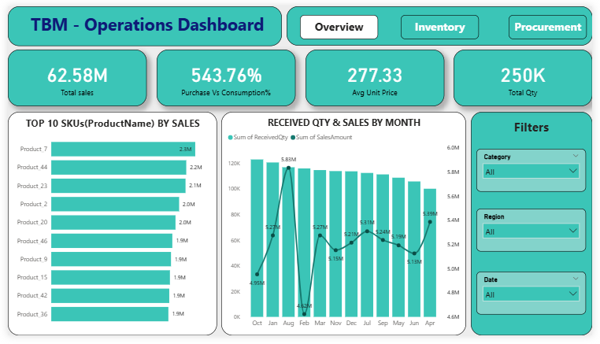
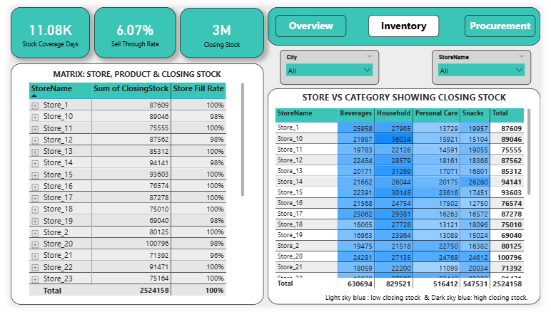

# TBM– Operations - Power BI Dashboard

_Built an interactive dashboard for TBM Consumer Products Pvt. Ltd. in the FMCG domain. Used Power BI to generate insights and help make better decisions for a business._

---

## 📌 Table of Contents
- <a href="#overview">Overview</a>
- <a href="#business-objective">Business Objective</a>
- <a href="#dataset">Dataset</a>
- <a href="#tools--technologies">Tools & Technologies</a>
- <a href="#project-structure">Project Structure</a>
- <a href="#research-questions--key-findings"> Key Findings</a>
- <a href="#author--contact">Author & Contact</a>

---

<h2><a class="anchor" id="overview"></a>Overview</h2>

Built an interactive Power BI dashboard for TBM Consumer Products Pvt. Ltd. in the FMCG domain, providing a comprehensive view of overall business performance. The dashboard highlights key performance indicators (KPIs), not only this but also it is divided into three parts, including Overview, Inventory and Procurement. If you want to know more, you can download the dashboard file and run it on your system.

---
<h2><a class="anchor" id="business-objective"></a>Business Objective</h2>

Company management needs an Operations Dashboard that combines Sales, Inventory and
Procurement data to improve decision making at store, regional and product levels.


---
<h2><a class="anchor" id="dataset"></a>Dataset</h2>

- The dataset used for this project was from a YouTube video( There was a challenge provided in the YouTube video to create a dashboard for a client.)
- If you want to know more about the YouTube channel, then you can search for this name on YouTube @thepowerbiman.

---

<h2><a class="anchor" id="tools--technologies"></a>Tools & Technologies</h2>

- Power BI:
   - Power Query Editor(Clean the dataset removed errors and null values from the dataset)
   - Dax functions
   - Dashboard design and Charts

-  Excel:
   - Imported data from the excel to Power BI

---
<h2><a class="anchor" id="project-structure"></a>Project Structure</h2>

```
TBM- OPERATIONS/
┣ 📂Images
┃ ┣ 📜Page-1.png
┃ ┣ 📜Page-2.png
┃ ┗ 📜Page-3.png
┣ 📜.gitignore
┣ 📜Dashboard.pbix
┣ 📜README.MD
┗ 📜TBM Report.docx


```


---
<h2><a class="anchor" id="research-questions--key-findings"></a> Key Findings</h2>

1. Company Purchase vs. Consumption (543.76%)
   - The purchase-to-consumption ratio of 543.76% clearly indicates a major overstocking issue.

2. Stock Coverage Days (11008K)
   - Based on the Stock Coverage Days KPI, the current inventory can last approximately 30 years and 4

3. Store Fill Rate Observation
   - Most stores are operating at a very high fill rate, with many maintaining 96%–98% stock       availability, indicating that nearly all SKUs are consistently stocked across stores.


---

<h2><a class="anchor" id="dashboard"></a>Dashboard</h2>

- Power BI  Dashboard shows:
  - Shows KPIs Purchase Vs Consumption%, Sell Through Rate, Stock Coverage Days, etc.
  - You find the Received quantity & Sales over the month and many more.

**Page-1(Overview):**



---
**Page-2(Inventory):**



---
**Page-3(Procurement):**


---

<h2><a class="anchor" id="author--contact"></a>Author & Contact</h2>

**Sumit Bhagat**  
 Data Analyst  
📧 Email: sumitbhagat066@gmail.com  
🔗 [LinkedIn](https://www.linkedin.com/in/sumitbhagat01x/)  
🔗 [Github](https://github.com/sumitbhagat1x)
